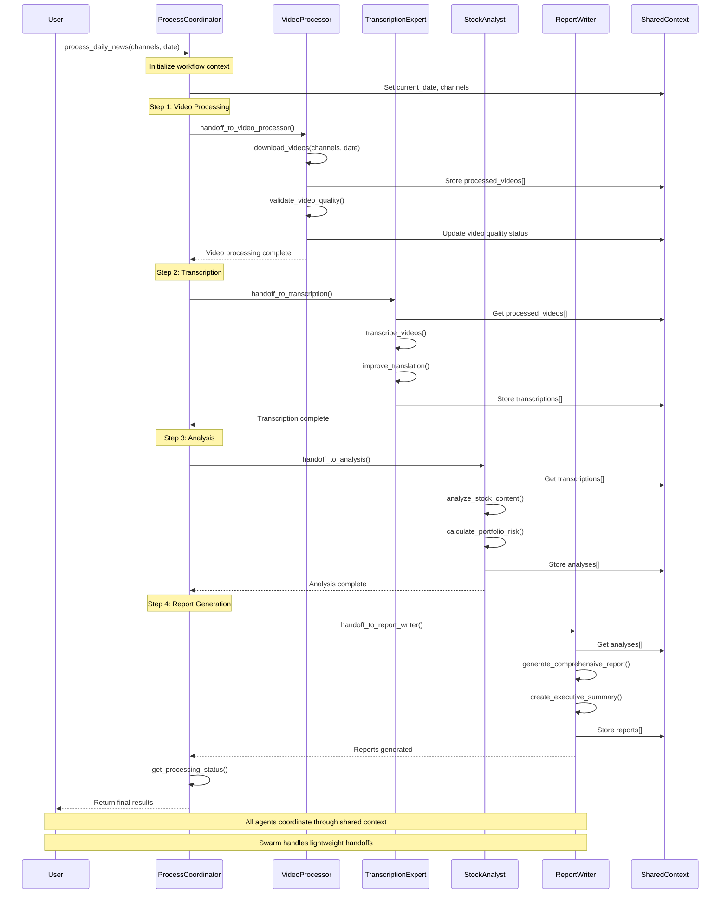

# Swarm Agent Workflow - Sequence Diagram

```mermaid
sequenceDiagram
    participant U as User
    participant C as ProcessCoordinator
    participant V as VideoProcessor
    participant T as TranscriptionExpert
    participant A as StockAnalyst
    participant R as ReportWriter
    participant Context as SharedContext

    U->>C: process_daily_news(channels, date)
    
    Note over C: Initialize workflow context
    C->>Context: Set current_date, channels
    
    Note over C: Step 1: Video Processing
    C->>V: handoff_to_video_processor()
    V->>V: download_videos(channels, date)
    V->>Context: Store processed_videos[]
    V->>V: validate_video_quality()
    V->>Context: Update video quality status
    V-->>C: Video processing complete
    
    Note over C: Step 2: Transcription
    C->>T: handoff_to_transcription()
    T->>Context: Get processed_videos[]
    T->>T: transcribe_videos()
    T->>T: improve_translation()
    T->>Context: Store transcriptions[]
    T-->>C: Transcription complete
    
    Note over C: Step 3: Analysis
    C->>A: handoff_to_analysis()
    A->>Context: Get transcriptions[]
    A->>A: analyze_stock_content()
    A->>A: calculate_portfolio_risk()
    A->>Context: Store analyses[]
    A-->>C: Analysis complete
    
    Note over C: Step 4: Report Generation
    C->>R: handoff_to_report_writer()
    R->>Context: Get analyses[]
    R->>R: generate_comprehensive_report()
    R->>R: create_executive_summary()
    R->>Context: Store reports[]
    R-->>C: Reports generated
    
    C->>C: get_processing_status()
    C-->>U: Return final results
    
    Note over U,R: All agents coordinate through shared context
    Note over U,R: Swarm handles lightweight handoffs
```
