# Framework Architecture Diagrams

This document contains comprehensive architectural diagrams, class diagrams, and Mermaid diagrams for all 9 AI framework implementations.

## 📊 High-Level System Architecture


## 🦜 LangChain Architecture

### Class Diagram


### Workflow Diagram


## 🤝 CrewAI Architecture

### Class Diagram


### Multi-Agent Workflow

```mermaid
graph TD
    A[Crew Manager] --> B[Video Processor Agent]
    A --> C[Transcription Expert Agent]
    A --> D[Stock Analyst Agent]
    A --> E[Report Writer Agent]
    
    B --> F[Download Videos Task]
    F --> G[Video Processing Complete]
    G --> H[Handoff to Transcription]
    
    C --> I[Transcribe Content Task]
    H --> I
    I --> J[Transcription Complete]
    J --> K[Handoff to Analysis]
    
    D --> L[Analyze Stocks Task]
    K --> L
    L --> M[Analysis Complete]
    M --> N[Handoff to Report]
    
    E --> O[Generate Report Task]
    N --> O
    O --> P[Final Report]
    
    subgraph "Agent Roles"
        B1[Role: Video Specialist<br/>Goal: Download & Process<br/>Backstory: YouTube Expert]
        C1[Role: Transcription Expert<br/>Goal: Telugu → English<br/>Backstory: Language Specialist]
        D1[Role: Senior Analyst<br/>Goal: Stock Analysis<br/>Backstory: Market Expert]
        E1[Role: Report Writer<br/>Goal: Professional Reports<br/>Backstory: Financial Writer]
    end
    
    B -.-> B1
    C -.-> C1
    D -.-> D1
    E -.-> E1
    
    style A fill:#2196f3
    style P fill:#4caf50
```


## 🏗️ AutoGen Architecture

### Class Diagram


### Conversation Flow


## 🧠 LangGraph Architecture

### State Machine Diagram


### Class Diagram


## 🎯 PydanticAI Architecture

### Class Diagram


### Type-Safe Workflow


## 🚀 Swarm Architecture

### Agent Handoff Diagram


### Class Diagram


## 🔧 Semantic Kernel Architecture

### Plugin Architecture


### Class Diagram


## 🔍 Haystack Architecture

### Pipeline Diagram


### Class Diagram


## 🤖 OpenAI Assistants Architecture

### Assistant Workflow


### Class Diagram


## 📊 Framework Comparison Matrix

### Complexity vs Features
```mermaid
quadrantChart
    title Framework Complexity vs Feature Richness
    x-axis Low Complexity --> High Complexity
    y-axis Basic Features --> Rich Features
    
    quadrant-1 High Value (Rich + Simple)
    quadrant-2 Feature Rich (Complex)
    quadrant-3 Basic (Simple)
    quadrant-4 Over-engineered
    
    OpenAI Assistants: [0.2, 0.8]
    Swarm: [0.3, 0.4]
    PydanticAI: [0.4, 0.6]
    LangChain: [0.7, 0.9]
    AutoGen: [0.6, 0.7]
    CrewAI: [0.5, 0.7]
    LangGraph: [0.8, 0.8]
    Semantic Kernel: [0.7, 0.6]
    Haystack: [0.9, 0.9]
```

### Setup Time vs Production Readiness
```mermaid
scatter-chart
    title "Framework Setup Time vs Production Readiness"
    x-axis "Setup Time (minutes)" 0 --> 12
    y-axis "Production Readiness Score" 0 --> 10
    
    OpenAI Assistants : [2, 9]
    PydanticAI : [3, 8]
    LangChain : [3.5, 9]
    AutoGen : [3.5, 7]
    Swarm : [4, 6]
    LangGraph : [4.5, 8]
    CrewAI : [5, 7]
    Semantic Kernel : [7.5, 8]
    Haystack : [8.5, 9]
```

## 🔄 Data Flow Comparison

### Framework Data Flow Patterns
```mermaid
graph TD
    subgraph "Sequential (LangChain)"
        A1[Input] --> A2[Tool 1] --> A3[Tool 2] --> A4[Tool 3] --> A5[Output]
    end
    
    subgraph "Multi-Agent (CrewAI)"
        B1[Manager] --> B2[Agent 1] --> B3[Agent 2] --> B4[Agent 3] --> B5[Result]
    end
    
    subgraph "Conversational (AutoGen)"
        C1[UserProxy] <--> C2[Agent 1]
        C2 <--> C3[Agent 2]
        C3 <--> C4[Agent 3]
        C4 --> C5[Consensus]
    end
    
    subgraph "State Machine (LangGraph)"
        D1[State 1] --> D2{Condition}
        D2 -->|Yes| D3[State 2]
        D2 -->|No| D4[State 3]
        D3 --> D5[Final State]
        D4 --> D5
    end
    
    subgraph "Pipeline (Haystack)"
        E1[Component 1] --> E2[Component 2] --> E3[Component 3]
        E1 --> E4[Component 4] --> E3
        E3 --> E5[Output]
    end
```

## 🚀 Performance Characteristics

### Framework Performance Metrics
```mermaid
gitgraph
    commit id: "Setup Time"
    branch OpenAI_Assistants
    commit id: "1-3 min"
    checkout main
    
    branch PydanticAI
    commit id: "2-4 min"
    checkout main
    
    branch LangChain
    commit id: "2-5 min"
    checkout main
    
    branch AutoGen
    commit id: "2-5 min"
    checkout main
    
    branch Swarm
    commit id: "3-5 min"
    checkout main
    
    branch LangGraph
    commit id: "3-6 min"
    checkout main
    
    branch CrewAI
    commit id: "3-7 min"
    checkout main
    
    branch Semantic_Kernel
    commit id: "5-10 min"
    checkout main
    
    branch Haystack
    commit id: "5-12 min"
```

This comprehensive diagram collection provides visual representations of all 9 framework architectures, their relationships, data flows, and comparative characteristics. Each diagram type serves a different purpose:

- **System Architecture**: Overall system view
- **Class Diagrams**: Code structure and relationships  
- **Workflow Diagrams**: Process flows and state transitions
- **Sequence Diagrams**: Interaction patterns
- **Comparison Charts**: Framework characteristics and trade-offs

These diagrams can be rendered in any Mermaid-compatible tool or documentation system.
